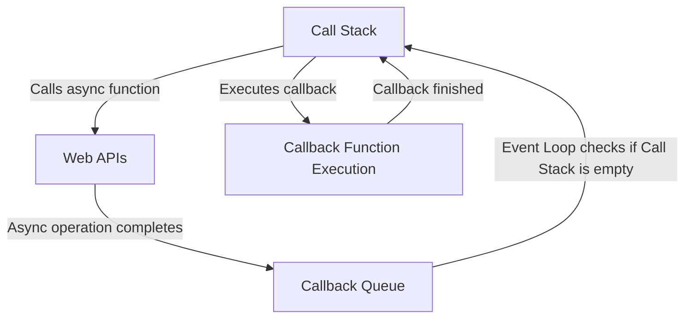

# Asynchronous JavaScript Theory

## What is Asynchronous Code in JavaScript?

JavaScript is a single-threaded language, meaning it can execute one piece of code at a time. However, many operations such as network requests, timers, or reading files are asynchronous — they do not block the main thread while waiting to complete. Asynchronous code allows JavaScript to perform long-running tasks without freezing the user interface or blocking other code execution.

## How Asynchronous Code Works in the JavaScript Execution Context

JavaScript has a unique concurrency model based on an **event loop**, **call stack**, and **callback queue**:

- **Call Stack**: This is where JavaScript keeps track of function calls. It operates in a Last In, First Out (LIFO) manner. When a function is called, it is pushed onto the stack, and when it returns, it is popped off.

- **Web APIs / Browser APIs**: When asynchronous functions like `setTimeout`, `fetch`, or DOM events are called, they are handled by the browser's Web APIs (or Node.js APIs in server-side JS). These APIs run independently of the call stack.

- **Callback Queue (Task Queue)**: Once an asynchronous operation completes, its callback function is placed in the callback queue, waiting to be executed.

- **Event Loop**: The event loop continuously checks if the call stack is empty. If it is, it takes the first callback from the callback queue and pushes it onto the call stack for execution.

This model allows JavaScript to handle asynchronous operations efficiently without blocking the main thread.

## Promises and Async/Await

To manage asynchronous operations more cleanly, JavaScript introduced **Promises** and later **async/await** syntax:

- **Promises** represent a value that may be available now, later, or never. They have three states: pending, fulfilled, or rejected. Promises allow chaining of asynchronous operations and better error handling.

- **Async/Await** is syntactic sugar built on top of Promises. It allows writing asynchronous code that looks synchronous, improving readability and maintainability.

Example:

```javascript
async function fetchData() {
  try {
    const response = await fetch('https://api.example.com/data');
    const data = await response.json();
    console.log(data);
  } catch (error) {
    console.error('Error:', error);
  }
}
fetchData();
```

## Real-Life Scenarios for Asynchronous Code

- **Fetching data from a server**: Using `fetch` or `XMLHttpRequest` to get data without blocking the UI.
- **Timers and delays**: Using `setTimeout` or `setInterval` to schedule code execution.
- **User interactions**: Handling events like clicks, scrolls, or keyboard input asynchronously.
- **Reading files**: In Node.js, reading files asynchronously to avoid blocking the event loop.
- **Animations**: Running animations smoothly without freezing the interface.

Asynchronous programming is essential for building responsive, efficient, and user-friendly web applications.

---

This theory provides a foundational understanding of asynchronous JavaScript and its role in the execution context.

## Flow Diagram of Asynchronous JavaScript Execution

Below is a flow diagram illustrating the interaction between the Call Stack, Web APIs, Callback Queue, and the Event Loop in JavaScript's asynchronous execution model.



This diagram shows:
- The Call Stack initiates an asynchronous function call.
- The async operation is handled by Web APIs outside the Call Stack.
- Once the async operation completes, its callback is placed in the Callback Queue.
- The Event Loop monitors the Call Stack and moves callbacks from the Callback Queue to the Call Stack when it is empty.
- The callback function is then executed on the Call Stack.

This flow ensures non-blocking asynchronous behavior in JavaScript.

## Simple Case-Based Example of Asynchronous Code

Consider the following example using `setTimeout` to simulate an asynchronous operation:

```javascript
console.log('Start');

setTimeout(() => {
  console.log('This happens asynchronously after 2 seconds');
}, 2000);

console.log('End');
```

### Explanation:
- The `console.log('Start')` runs first and prints "Start".
- The `setTimeout` schedules the callback function to run after 2 seconds but does not block the code.
- The `console.log('End')` runs immediately after scheduling the timeout.
- After 2 seconds, the callback inside `setTimeout` is executed, printing the asynchronous message.

This example demonstrates how JavaScript handles asynchronous operations without blocking the main thread, allowing other code to run while waiting for the asynchronous task to complete.

## Callbacks and Memory Heap in Asynchronous JavaScript

When an asynchronous function is called, the callback function associated with it is stored in the **memory heap** as a closure. This closure retains access to the variables and environment present at the time the asynchronous function was invoked.

### How Memory Heap and Callbacks Interact:

- When the async operation is initiated, the callback function is allocated memory in the heap.
- The callback retains references to variables in its lexical scope, preventing them from being garbage collected until the callback is executed.
- Once the async operation completes, the callback is moved to the callback queue.
- When the event loop pushes the callback onto the call stack for execution, the callback uses the retained variables from the heap.
- After the callback finishes execution and no longer references those variables, the memory can be freed by garbage collection.

This mechanism ensures that asynchronous callbacks have access to the necessary data even after the original function has returned, by preserving the environment in the memory heap.

### Example:

```javascript
function asyncOperation() {
  let message = 'Hello from async callback!';

  setTimeout(() => {
    console.log(message); // The callback retains access to 'message' via closure in the heap
  }, 1000);
}

asyncOperation();
```

In this example, the callback function inside `setTimeout` forms a closure that keeps the variable `message` alive in the memory heap until the callback executes, even though `asyncOperation` has already returned.

Understanding this interaction between callbacks and the memory heap is crucial for managing memory and avoiding leaks in asynchronous JavaScript code.

## Difference Between Asynchronous and Synchronous Code

| Aspect               | Synchronous Code                          | Asynchronous Code                          |
|----------------------|------------------------------------------|--------------------------------------------|
| Execution            | Executes line by line, blocking further code until current completes | Executes without blocking, allowing other code to run concurrently |
| Call Stack           | Functions are pushed and popped in order, blocking the stack | Async operations offload to Web APIs, callbacks queued for later execution |
| Blocking             | Blocks the main thread until completion  | Non-blocking, main thread remains free     |
| Use Cases            | Simple, sequential tasks                  | Long-running tasks like network requests, timers, user interactions |
| Example              | `console.log('A'); console.log('B');`    | `setTimeout(() => console.log('B'), 1000); console.log('A');` |

### Example:

Synchronous code example:

```javascript
console.log('Start');
console.log('End');
```

Asynchronous code example:

```javascript
console.log('Start');
setTimeout(() => {
  console.log('End');
}, 1000);
```

In the synchronous example, "Start" and "End" are logged immediately in order. In the asynchronous example, "Start" is logged first, and "End" is logged after 1 second, demonstrating non-blocking behavior.

## Difference Between Blocking and Non-Blocking Code

| Aspect               | Blocking Code                            | Non-Blocking Code                        |
|----------------------|----------------------------------------|-----------------------------------------|
| Execution            | Blocks the execution thread until task completes | Allows other tasks to run concurrently  |
| Impact on UI         | Freezes UI or main thread during execution | Keeps UI responsive and interactive     |
| Use Cases            | Simple, quick tasks or critical sections | Long-running tasks like I/O, network requests |
| Example              | Synchronous file read, heavy computations | Asynchronous file read, network calls   |

### Example:

Blocking code example:

```javascript
function blockingTask() {
  const start = Date.now();
  while (Date.now() - start < 2000) {
    // Busy wait for 2 seconds
  }
  console.log('Blocking task finished');
}
console.log('Start');
blockingTask();
console.log('End');
```

Non-blocking code example:

```javascript
console.log('Start');
setTimeout(() => {
  console.log('Non-blocking task finished');
}, 2000);
console.log('End');
```

In the blocking example, the main thread is busy for 2 seconds, delaying the execution of subsequent code. In the non-blocking example, the main thread continues executing while the asynchronous task completes in the background.
